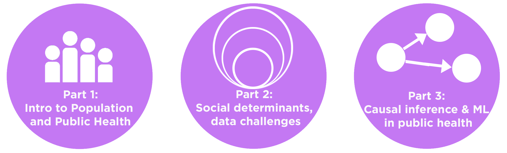

## Table of contents
{: .no_toc .text-delta }

1. TOC
{:toc}

# OVERVIEW
This repository contains information about the tutorial [Machine Learning in Population and Public Health: challenges and opportunites](https://www.chilconference.org/workshop_b.html) at [ACM Conference on Health, Information and Learning, 2020](https://www.chilconference.org/index.html). 
 

