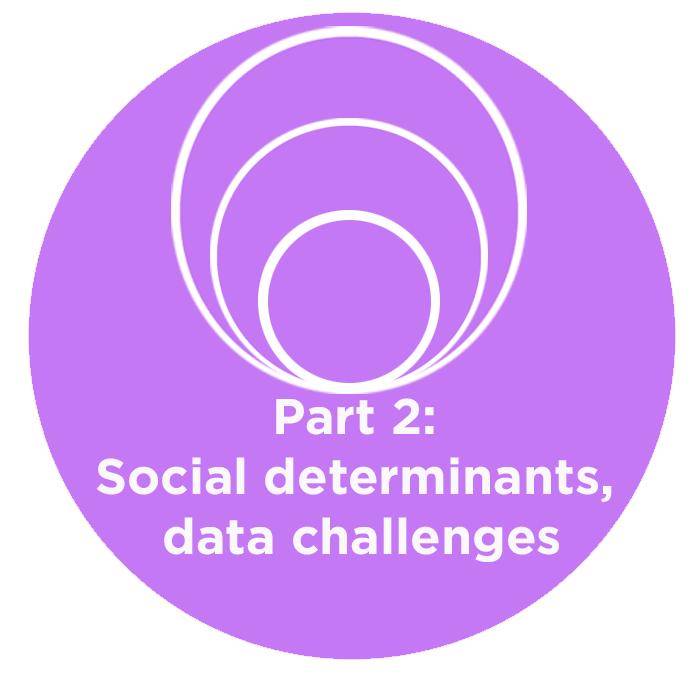
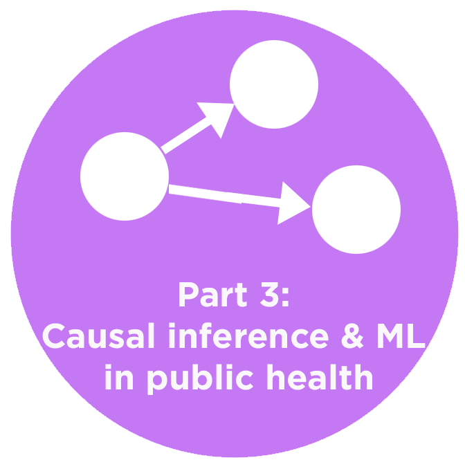

This repository contains information about the tutorial [Machine Learning in Population and Public Health: challenges and opportunites](https://www.chilconference.org/tutorial_b.html) at [ACM Conference on Health, Information and Learning, 2020](https://www.chilconference.org/index.html). A full summary of the tutorial is provided in [this document](./docs/ACM_chil_tutorial_summary.pdf). Citation:  
**Mhasawade, Vishwali, Yuan Zhao, and Rumi Chunara. “Machine Learning in Population and Public Health.” ArXiv:2008.07278 [Cs], July 21, 2020. [http://arxiv.org/abs/2008.07278](http://arxiv.org/abs/2008.07278).**

## Table of contents
{: .no_toc .text-delta }

1. TOC
{:toc}

## Audience
The primary audience for this tutorial is computer science and statistics researchers, who are interested in how machine learning may provide opportunities to address challenges in health research and practice. In particular, those who may already be working in machine learning in <i>healthcare</i> may find discussions in this tutorial helpful regarding machine learning with respect to the spectrum of health across prevention and promotion, to health protection, diagnosis, treatment and care as well as the integration and balance between these aspects. Public health professionals and researchers who have the prerequisite background of an introductory understanding of machine learning and causal inference may also be interested in this tutorial.     

## Goals, Overview and Slides
The goals of this tutorial are to: 
1) Familiarize the audience with research in public and population health 
2) Identify open areas relevant to machine learning and health equity 
3) Activate the machine learning community on challenges in public/population health 

The tutorial is composed of three parts. <b>Click each icon to access the slides</b>.

<table>
<tbody>
<tr>
<td style="width:290px;"></td>
<td style="width:290px;"></td>
<td style="width:290px;"></td>
</tr>
<tr style="height:50px;width:250px;" valign="top">
<td>
<ul>
<li>What are Public and Population health?</li>
</ul>
</td>
<td>
<ul>
<li>Theory and framework of social determinants of health (SDoH)</li>
<li>Measurement of SDoH</li> 
<li>SDoH interventions</li>
<li>SDoH in machine learning models</li>
</ul>
</td>
<td>
<ul>
<li>Taxonomy of health tasks</li>
<li>Causal inference in public health</li>
<li>Challenges with using proxies</li>
<li>Algorithmic fairness and health disparities</li>
</ul>
</td>
</tr>
</tbody>
</table>

## Taxonomy
{: .d-block }

In order to demonstrate the use of machine learning across aspects of health, comprehensively, we developed a taxonomy of Machine Learning in <i>health</i> tasks (broadly) and list example studies below.

Identify

<ul>
<li>

Disease incidence at population level

<ul> 
<li> <a href="https://www.nature.com/articles/nature12060?page=32">
Bhatt, Samir, et al. "The global distribution and burden of dengue." Nature 496.7446 (2013): 504-507. 
</a>  
</li>
</ul>

</li>

<li>

Disease detection including behaviors and markers

<ul>
<li> <a href="https://jamanetwork.com/journals/jama/article-abstract/2588763">
Gulshan, Varun, et al. "Development and validation of a deep learning algorithm for detection of diabetic retinopathy in retinal fundus photographs." Jama 316.22 (2016): 2402-2410.
</a>
</li>

<li> <a href="https://arxiv.org/abs/1807.10215">
Lu, Jen-Tang, et al. "Deepspine: Automated lumbar vertebral segmentation, disc-level designation, and spinal stenosis grading using deep learning." arXiv preprint arXiv:1807.10215 (2018). </a> </li> 

<li> <a href="https://static1.squarespace.com/static/59d5ac1780bd5ef9c396eda6/t/5b737c761ae6cf102e2857d6/1534295158812/Arthroplasty+Identification+MLHC+2018+FINAL.pdf">
Paul, H. Yi, et al. "Deep Learning-Based Identification Of Traditional Hip, Knee, and Shoulder Arthroplasty and Application to Alternative Arthroplasty Designs." (2018). </a> </li> 

<li> <a href="https://ieeexplore.ieee.org/abstract/document/9000602">
M. Hu et al., "Learning to Recognize Chest-Xray Images Faster and More Efficiently Based on Multi-Kernel Depthwise Convolution," in IEEE Access, vol. 8, pp. 37265-37274, 2020, doi: 10.1109/ACCESS.2020.2974242. </a> </li> 
</ul>

</li>

<li>

Multi-level factors related to health outcomes

<ul><li> <a href="https://www.ncbi.nlm.nih.gov/pmc/articles/PMC7004474/">
Weichenthal, Scott, et al. "Within-city Spatial Variations in Ambient Ultrafine Particle Concentrations and Incident Brain Tumors in Adults." Epidemiology (Cambridge, Mass.) 31.2 (2020): 177.
</a></li></ul>

</li>

<li>

External validity of policies

<ul><li> <a href="https://www.frontiersin.org/articles/10.3389/fped.2017.00149/full">
Hermanspann T, Schoberer M, Robel-Tillig E, et al. Incidence and Severity of Prescribing Errors in Parenteral Nutrition for Pediatric Inpatients at a Neonatal and Pediatric Intensive Care Unit. Front Pediatr. 2017;5:149. Published 2017 Jun 30. doi:10.3389/fped.2017.00149 
</a></li></ul>

</li>

<li>

Fairness of policies

<ul><li> <a href="https://dl.acm.org/doi/abs/10.1145/3287560.3287593">
Obermeyer, Ziad, and Sendhil Mullainathan. "Dissecting racial bias in an algorithm that guides health decisions for 70 million people." Proceedings of the Conference on Fairness, Accountability, and Transparency. 2019.
</a></li></ul>

</li>

<li>

Causal treatment effects 

<ul><li> <a href="https://academic.oup.com/aje/article/188/8/1569/5486454">
Lodi, Sara, et al. "Effect estimates in randomized trials and observational studies: comparing apples with apples." American journal of epidemiology 188.8 (2019): 1569-1577.
</a></li>

<li> 
<a href="https://europepmc.org/article/med/32501812">
Chiu, Yu-Han, et al. "The effect of prenatal treatments on offspring events in the presence of competing events: an application to a randomized trial of fertility therapies." Epidemiology (Cambridge, Mass.) (2020).
</a>
</li>

<li> 
<a href="https://www.annualreviews.org/doi/abs/10.1146/annurev-genom-083117-021731">
Burgess, Stephen, Christopher N. Foley, and Verena Zuber. "Inferring causal relationships between risk factors and outcomes from genome-wide association study data." Annual review of genomics and human genetics 19 (2018): 303-327.
</a>
</li>
</ul>

</li>

<li>

Individuals/populations to minimize healthcare costs 

<ul><li> <a href="https://www.ncbi.nlm.nih.gov/pmc/articles/PMC1448604/pdf/0942139.pdf">
Rose, Sherri, Savannah L. Bergquist, and Timothy J. Layton. "Computational health economics for identification of unprofitable health care enrollees." Biostatistics 18.4 (2017): 682-694.
</a></li>

<li> 
<a href="https://www.healthaffairs.org/doi/abs/10.1377/hlthaff.2016.0012">
McGuire, Thomas G. "Achieving mental health care parity might require changes in payments and competition." Health Affairs 35.6 (2016): 1029-1035.
</a>
</li>

<li> 
<a href="https://europepmc.org/article/med/23513755">
Williams, J. "A new model for care population management." Healthcare Financial Management: Journal of the Healthcare Financial Management Association 67.3 (2013): 68-76.</a>
</li>

<li> 
<a href="https://www.acpjournals.org/doi/abs/10.7326/0003-4819-141-12-200412210-00008">
Childs, John D., et al. "A clinical prediction rule to identify patients with low back pain most likely to benefit from spinal manipulation: a validation study." Annals of internal medicine 141.12 (2004): 920-928.
</a>
</li>

<li> 
<a href="https://arxiv.org/abs/2006.07590">
Nishtala, Siddharth, et al. "Missed calls, Automated Calls and Health Support: Using AI to improve maternal health outcomes by increasing program engagement." arXiv preprint arXiv:2006.07590 (2020).</a>
</li>

<li> 
<a href="http://aruneshsinha.net/Files/Other/Papers/who_and_when_to_screen.pdf">
Ou, Han-Ching, et al. "Who and When to Screen: Multi-Round Active Screening for Network Recurrent Infectious Diseases Under Uncertainty." Proceedings of the 19th International Conference on Autonomous Agents and MultiAgent Systems. 2020.
</a>
</li>
</ul>

</li>

<li>

Individuals/subpopulations to target interventions  

<ul><li> <a href="https://academic.oup.com/biostatistics/article-abstract/18/4/682/3077114">
Braveman, Paula A., et al. "An approach to studying social disparities in health and health care." American Journal of Public Health 94.12 (2004): 2139-2148.
</a></li>

<li> 
<a href="https://bmjopen.bmj.com/content/7/1/e011580.abstract">
Tamang, Suzanne, et al. "Predicting patient ‘cost blooms’ in Denmark: a longitudinal population-based study." BMJ open 7.1 (2017): e011580.</a>
</li>

<li> 
<a href="https://www.sciencedirect.com/science/article/pii/S016762961830290X">
Bergquist, Savannah L., et al. "Data transformations to improve the performance of health plan payment methods." Journal of health economics 66 (2019): 195-207.</a>
</li>

<li> 
<a href="https://ajp.psychiatryonline.org/doi/abs/10.1176/ajp.2006.163.4.724">
Drozd, Edward M., et al. "Patient casemix classification for medicare psychiatric prospective payment." American Journal of Psychiatry 163.4 (2006): 724-732.
</a>
</li>

<li> 
<a href="https://academic.oup.com/ije/article-abstract/doi/10.1093/ije/dyaa035/5814327">
Rose, Sherri. "Intersections of machine learning and epidemiological methods for health services research." International Journal of Epidemiology (2020).</a>
</li>

<li> 
<a href="https://onlinelibrary.wiley.com/doi/abs/10.1111/biom.13206?casa_token=oHkCsdUBcFYAAAAA:7IF1LBK-6dIzdc91k_0UJI7EQVC4zoPZATmrvOgsN_8M-rq0MZwlN0mnkCTu5UdgqdAOsXaN96cILA">
Zink, Anna, and Sherri Rose. "Fair regression for health care spending." Biometrics (2019).
</a>
</li>

<li> 
<a href="https://onlinelibrary.wiley.com/doi/abs/10.1111/1475-6773.12464">
Rose, Sherri. "A machine learning framework for plan payment risk adjustment." Health services research 51.6 (2016): 2358-2374.</a>
</li>

<li> 
<a href="https://onlinelibrary.wiley.com/doi/abs/10.1002/hec.3657">
Park, Sungchul, and Anirban Basu. "Alternative evaluation metrics for risk adjustment methods." Health economics 27.6 (2018): 984-1010.</a>
</li>

<li> 
<a href="https://onlinelibrary.wiley.com/doi/abs/10.1111/1475-6773.12818">
Shrestha, Akritee, et al. "Mental health risk adjustment with clinical categories and machine learning." Health services research 53 (2018): 3189-3206.</a>
</li>
</ul>
</li></ul>

 

Design

<ul>
<li>

Individual-level interventions

<ul><li> <a href="https://www.aaai.org/ocs/index.php/AAAI/AAAI18/paper/viewPaper/17358">
Rahmattalabi, Aida, et al. "Influence Maximization for Social Network Based Substance Abuse Prevention." Thirty-Second AAAI Conference on Artificial Intelligence. 2018.
</a></li></ul>

</li>

<li>

Community/group-level interventions 

<ul><li> <a href="https://ieeexplore.ieee.org/abstract/document/6605814">
Ahsan, GM Tanimul, et al. "Toward an mHealth intervention for smoking cessation." 2013 IEEE 37th Annual Computer Software and Applications Conference Workshops. IEEE, 2013.
</a></li></ul>

</li>

<li>

Public Policy 

<ul><li> <a href="https://ajph.aphapublications.org/doi/full/10.2105/AJPH.94.12.2139">
Braveman, Paula A., et al. "An approach to studying social disparities in health and health care." American Journal of Public Health 94.12 (2004): 2139-2148.
</a></li></ul>
</li>
</ul>
 

Prediction

<ul>
<li>

Risk scores (clincal algorithms) 

<ul><li> <a href="https://www.nejm.org/doi/full/10.1056/NEJMms2004740">
Vyas, Darshali A., Leo G. Eisenstein, and David S. Jones. "Hidden in Plain Sight—Reconsidering the Use of Race Correction in Clinical Algorithms." (2020).
</a></li></ul>

</li>

<li>

Disease prognosis  

<ul><li> <a href="https://www.liebertpub.com/doi/abs/10.1089/BIG.2015.0020">
Razavian, Narges, et al. "Population-level prediction of type 2 diabetes from claims data and analysis of risk factors." Big Data 3.4 (2015): 277-287.</a></li>
<li> <a href="https://www.aeaweb.org/articles?id=10.1257/aer.p20171084">
Mullainathan, Sendhil, and Ziad Obermeyer. "Does machine learning automate moral hazard and error?." American Economic Review 107.5 (2017): 476-80.</a></li>
<li> <a href="https://www.thieme-connect.com/products/ejournals/html/10.4338/ACI-2015-03-RA-0036">
Dugan, Tamara M., et al. "Machine learning techniques for prediction of early childhood obesity." Applied clinical informatics 6.03 (2015): 506-520.</a></li>
<li> <a href="https://aasldpubs.onlinelibrary.wiley.com/doi/abs/10.1002/hep.27750">
Tighe, Patrick J., et al. "Teaching a machine to feel postoperative pain: combining high-dimensional clinical data with machine learning algorithms to forecast acute postoperative pain." Pain Medicine 16.7 (2015): 1386-1401.</a></li>
<li> <a href="https://academic.oup.com/painmedicine/article-abstract/16/7/1386/1918425">
Konerman, Monica A., et al. "Improvement of predictive models of risk of disease progression in chronic hepatitis C by incorporating longitudinal data." Hepatology 61.6 (2015): 1832-1841.</a></li>
<li> <a href="https://www.ncbi.nlm.nih.gov/pmc/articles/PMC6287925/">
Bergquist, Savannah L., et al. "Classifying lung cancer severity with ensemble machine learning in health care claims data." Proceedings of machine learning research 68 (2017): 25.</a></li>
<li> <a href="http://proceedings.mlr.press/v68/fiorini17a.html">
Fiorini, Samuele, et al. "Temporal prediction of multiple sclerosis evolution from patient-centered outcomes." Machine Learning for Healthcare Conference. 2017.</a></li>
<li> <a href="https://arxiv.org/abs/1708.05894">
Futoma, Joseph, et al. "An improved multi-output gaussian process rnn with real-time validation for early sepsis detection." arXiv preprint arXiv:1708.05894 (2017).</a></li>
</ul>

</li>

<li>

Treatment/procedure effectiveness  

<ul><li> <a href="https://onlinelibrary.wiley.com/doi/abs/10.1111/1475-6773.12068">
Watkins, Stephanie, et al. "An Empirical Comparison of Tree‐Based Methods for Propensity Score Estimation." Health services research 48.5 (2013): 1798-1817.</a></li>

<li> <a href="https://onlinelibrary.wiley.com/doi/abs/10.1002/hec.3189">
Kreif, Noémi, et al. "Evaluation of the effect of a continuous treatment: a machine learning approach with an application to treatment for traumatic brain injury." Health economics 24.9 (2015): 1213-1228.</a></li>

<li> <a href="https://journals.sagepub.com/doi/full/10.1177/0962280214521341">
Kreif, Noémi, et al. "Evaluating treatment effectiveness under model misspecification: a comparison of targeted maximum likelihood estimation with bias-corrected matching." Statistical methods in medical research 25.5 (2016): 2315-2336.</a></li>

<li> <a href="https://academic.oup.com/aje/article-abstract/186/12/1370/3886032">
Kreif, Noémi, et al. "Estimating the comparative effectiveness of feeding interventions in the pediatric intensive care unit: a demonstration of longitudinal targeted maximum likelihood estimation." American journal of epidemiology 186.12 (2017): 1370-1379.</a></li>

<li> <a href="https://onlinelibrary.wiley.com/doi/abs/10.1111/biom.12927">
Rose, Sherri, and Sharon‐Lise Normand. "Double robust estimation for multiple unordered treatments and clustered observations: Evaluating drug‐eluting coronary artery stents." Biometrics 75.1 (2019): 289-296.</a></li>

<li> <a href="https://arxiv.org/abs/1705.08498">
Suresh, Harini, et al. "Clinical intervention prediction and understanding using deep networks." arXiv preprint arXiv:1705.08498 (2017).</a></li>

<li> <a href="https://arxiv.org/abs/1807.06489">
Mahmood, Rafid, et al. "Automated treatment planning in radiation therapy using generative adversarial networks." arXiv preprint arXiv:1807.06489 (2018).</a></li>

<li> <a href="https://www.ncbi.nlm.nih.gov/pmc/articles/pmc6110979/">
Bihorac, Azra, et al. "MySurgeryRisk: development and validation of a machine-learning risk algorithm for major complications and death after surgery." Annals of surgery 269.4 (2019): 652.</a></li>

<li> <a href="https://www.nature.com/articles/s41746-018-0029-1//">
Rajkomar, Alvin, et al. "Scalable and accurate deep learning with electronic health records." NPJ Digital Medicine 1.1 (2018): 18.</a></li>

<li> <a href="https://bmjopen.bmj.com/content/8/8/e025204.abstract">
Larney, Sarah, et al. "Using routinely collected data to understand and predict adverse outcomes in opioid agonist treatment: Protocol for the Opioid Agonist Treatment Safety (OATS) Study." BMJ open 8.8 (2018): e025204.</a></li>

<li> <a href="https://academic.oup.com/painmedicine/article-abstract/16/7/1386/1918425">
Tighe, Patrick J., et al. "Teaching a machine to feel postoperative pain: combining high-dimensional clinical data with machine learning algorithms to forecast acute postoperative pain." Pain Medicine 16.7 (2015): 1386-1401.</a></li>

<li> <a href="https://journals.lww.com/transplantjournal/FullText/2017/04000/Machine_Learning_Algorithms_Predict_Graft_Failure.25.aspx/">
Lau, Lawrence, et al. "Machine-learning algorithms predict graft failure after liver transplantation." Transplantation 101.4 (2017): e125-e132.</a></li>

<li> <a href="https://link.springer.com/article/10.1186/s13054-019-2411-z">
Zhang, Zhongheng, Kwok M. Ho, and Yucai Hong. "Machine learning for the prediction of volume responsiveness in patients with oliguric acute kidney injury in critical care." Critical Care 23.1 (2019): 112.</a></li>
</ul>

</li>

<li>

Chances of mortality 

<ul><li> <a href="https://journalofethics.ama-assn.org/article/can-ai-help-reduce-disparities-general-medical-and-mental-health-care/2019-02">
Chen, Irene Y., Peter Szolovits, and Marzyeh Ghassemi. "Can AI help reduce disparities in general medical and mental health care?." AMA journal of ethics 21.2 (2019): 167-179. 
</a></li>

<li> <a href="https://journalofethics.ama-assn.org/article/can-ai-help-reduce-disparities-general-medical-and-mental-health-care/2019-02">
Einav, Liran, et al. "Predictive modeling of US health care spending in late life." Science 360.6396 (2018): 1462-1465.
</a></li>

<li> <a href="https://www.nature.com/articles/s41746-018-0029-1/">
Rajkomar, Alvin, et al. "Scalable and accurate deep learning with electronic health records." NPJ Digital Medicine 1.1 (2018): 18.
</a></li>

<li> <a href="http://proceedings.mlr.press/v68/forte17a.html">
Forte, José Castela, et al. "Predicting long-term mortality with first week post-operative data after Coronary Artery Bypass Grafting using Machine Learning models." Machine Learning for Healthcare Conference. 2017.
</a></li>
</ul>

</li>

<li>

Treatment adherence 

<ul><li> <a href="https://onlinelibrary.wiley.com/doi/abs/10.1111/1475-6773.12310">
Franklin, Jessica M., et al. "Observing versus predicting: initial patterns of filling predict long‐term adherence more accurately than high‐dimensional modeling techniques." Health services research 51.1 (2016): 220-239.
</a></li>

<li> <a href="https://ieeexplore.ieee.org/abstract/document/7889104/">
Karanasiou, Georgia Spiridon, et al. "Predicting adherence of patients with HF through machine learning techniques." Healthcare technology letters 3.3 (2016): 165-170.
</a></li>
</ul>

</li>

<li>

Readmission to hospital 

<ul><li> <a href="https://dl.acm.org/doi/abs/10.1145/3287560.3287593">
Galiatsatos, Panagis, et al. "The Association Between Neighborhood Socioeconomic Disadvantage and Readmissions for Patients Hospitalized With Sepsis." Critical Care Medicine 48.6 (2020): 808-814. 
</a></li>

<li> <a href="https://journalofethics.ama-assn.org/article/can-ai-help-reduce-disparities-general-medical-and-mental-health-care/2019-02">
Chen, Irene Y., Peter Szolovits, and Marzyeh Ghassemi. "Can AI help reduce disparities in general medical and mental health care?." AMA journal of ethics 21.2 (2019): 167-179. 
</a></li>
</ul>
</li>
</ul>

 

Allocation

<ul>
<li>

Resources to individuals  

<ul><li> <a href="https://onlinelibrary.wiley.com/doi/abs/10.1111/ajt.15115">
Snyder, Jon J., et al. "Organ distribution without geographic boundaries: a possible framework for organ allocation." American Journal of Transplantation 18.11 (2018): 2635-2640.
</a></li>

<li> <a href="https://www.sciencedirect.com/science/article/pii/S001236921551283X">
Davis, Steven Q., and Edward R. Garrity Jr. "Organ allocation in lung transplant." Chest 132.5 (2007): 1646-1651.
</a></li>

<li> <a href="https://cjasn.asnjournals.org/content/12/5/848.short">
Asch, William S., and Margaret J. Bia. "New organ allocation system for combined liver-kidney transplants and the availability of kidneys for transplant to patients with stage 4–5 CKD." Clinical Journal of the American Society of Nephrology 12.5 (2017): 848-852.
</a></li>

<li> <a href="https://www.aaai.org/ojs/index.php/AAAI/article/view/3838">
Kube, Amanda, Sanmay Das, and Patrick J. Fowler. "Allocating interventions based on predicted outcomes: A case study on homelessness services." Proceedings of the AAAI Conference on Artificial Intelligence. Vol. 33. 2019.
</a></li>
</ul>

 </li>

<li>

Resources to populations  

<ul><li> <a href="https://journals.sagepub.com/doi/abs/10.1111/ijs.12571">
Lord, Aaron S., et al. "Discharge educational strategies for reduction of vascular events (DESERVE): design and methods." International journal of stroke 10.SA100 (2015): 151-154.
</a></li>

<li> <a href="https://teamcore.seas.harvard.edu/files/teamcore/files/2018_14_teamcore_bridging_gap_theory.pdf">
Yadav, Amulya, et al. "Bridging the Gap Between Theory and Practice in Influence Maximization: Raising Awareness about HIV among Homeless Youth." IJCAI. 2018.
</a></li>

<li> <a href="https://www.aaai.org/ocs/index.php/AAAI/AAAI18/paper/viewPaper/17358">
Rahmattalabi, Aida, et al. "Influence Maximization for Social Network Based Substance Abuse Prevention." Thirty-Second AAAI Conference on Artificial Intelligence. 2018.
</a></li>
</ul>

</li>

<li>

Resources within hospital  

<ul><li> <a href="https://journals.lww.com/cinjournal/Fulltext/2018/05000/A_Hospital_Bed_Allocation_Hybrid_Model_Based_on.7.aspx">
da Silveira Grübler, Murillo, et al. "A hospital bed allocation hybrid model based on situation awareness." CIN: Computers, Informatics, Nursing 36.5 (2018): 249-255.
</a></li>

<li> <a href="https://journals.sagepub.com/doi/abs/10.1177/0969733018759831">
Scott, P. Anne, et al. "Resource allocation and rationing in nursing care: A discussion paper." Nursing Ethics 26.5 (2019): 1528-1539.
</a></li>

<li> <a href="https://link.springer.com/content/pdf/10.1007/s10729-015-9335-1.pdf">
Feng, Yen-Yi, I-Chin Wu, and Tzu-Li Chen. "Stochastic resource allocation in emergency departments with a multi-objective simulation optimization algorithm." Health Care Management Science 20.1 (2017): 55-75.
</a></li>
</ul>

</li>

<li>

Care management at individual and population level 

<ul><li> <a href="https://www.sciencedirect.com/science/article/pii/S073567571730468">
Chacko, Jerel, et al. "Effect of an emergency department opioid prescription policy on prescribing patterns." The American Journal of Emergency Medicine 35.9 (2017): 1327-1329.
</a></li>

<li> <a href="https://www.sciencedirect.com/science/article/pii/S073646791630988X1">
Osborn, Scott R., et al. "Changes in provider prescribing patterns after implementation of an emergency department prescription opioid policy." The Journal of emergency medicine 52.4 (2017): 538-546.
</a></li>

<li> <a href="https://www.ncbi.nlm.nih.gov/pubmed/8221823">
[Kucukarslan, S., et al. "Points to consider about prescription drug prices: an overview of federal policy and pricing studies." Clinical therapeutics 15.4 (1993): 726.]
</a></li>
</ul>
</li>
</ul>
 

## About Us
<table>
<tbody>
<tr>
    <th ><a href="https://rumichunara.github.io/">Rumi Chunara</a></th>
    <th ><a href="https://vishwali.github.io">Vishwali Mhasawade</a></th> 
    <th ><a href="https://scholar.google.com/citations?user=uDnVOCQAAAAJ&hl=en">Yuan Zhao</a></th>
  </tr>
<tr style="height:50px;">
<td >Rumi Chunara is an Assistant Professor at NYU, jointly appointed at the Tandon School of Engineering (in Computer Science) and the School of Global Public Health (in Biostatistics/Epidemiology). Her research group focuses on developing computational and statistical approaches for acquiring, integrating and using data to improve population-level public health, with data from clinical and outside-clinic sources. She is an MIT TR 35 under 35, NSF Career, Facebook Research Award and Max Planck Sabbatical Award winner.</td>
<td > Vishwali Mhasawade is a Ph.D. student at NYU Tandon School of Engineering. She is interested in working at the intersection of causal inference and algorithmic fairness with the goal of mitigating health disparities. Her previous work focused on causal transport, to improve understanding of population-level information while incorporating data from multiple environments.</td>
<td >Yuan Zhao is a doctoral student at NYU School of Global Public Health. She is interested in application of machine learning in disease prediction and causal inference. Her previous research included modeling transmission and prevention of STI and HIV/AIDS among marginalized populations and evaluating novel drugs treating multidrug resistant tuberculosis using targeted maximum likelihood estimation (TMLE).</td>
</tr>
<tr>
<td></td>
<td></td>
<td></td>
</tr>
</tbody>
</table> 

